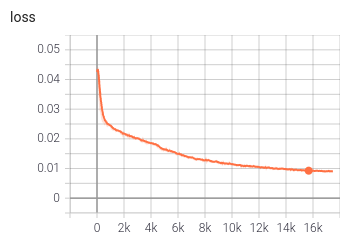
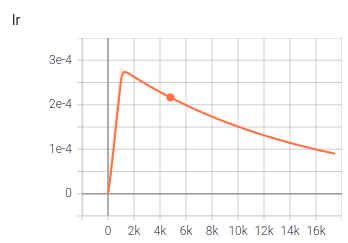
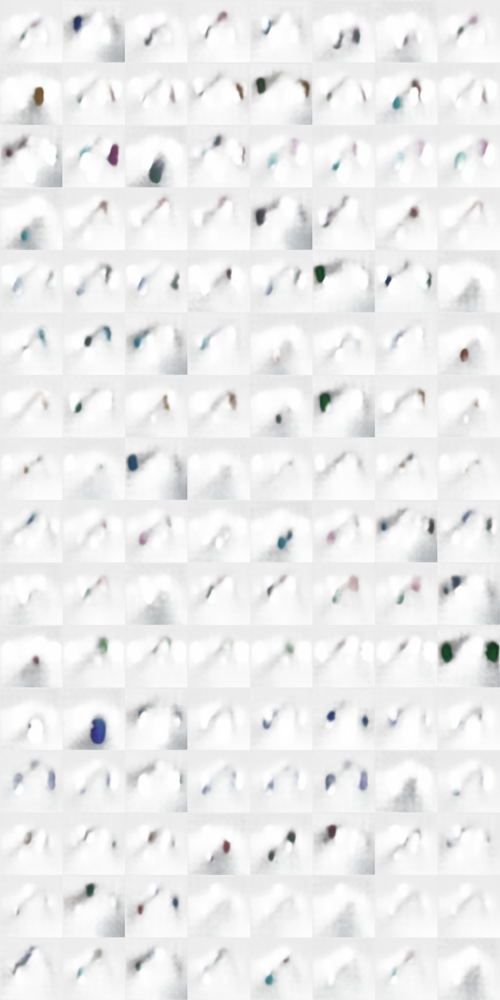

# Slot Attention

Reproducing slot-attention based object discovery experiment.

## Training:

```bash
python3 train.py
```

Training progression plot for loss:



Learning rate scheduling visualization:



## Result visualization:

Below script shows the results for unsupervised object discovery:

```bash
python3 evaluate.py
```



Accordingly, we find each slot that _sometimes_ successfully finds discrete objects.
